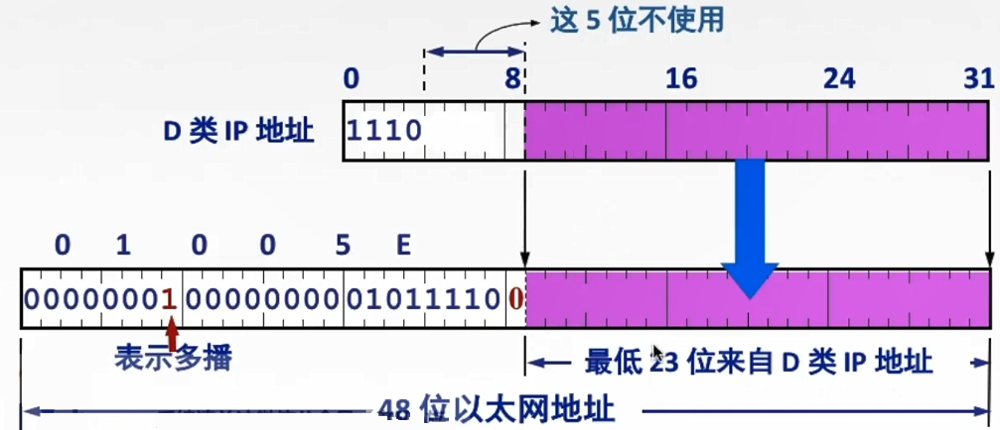

# 4.5 IP组播

## 4.5.1 IP数据报的三种传输方式

- **单播**：点对点传输
- **广播**：点对多传输
- **组播（多播）**：点对多点传输
  - 网络中有多个用户需要数据
  - 组播发送者仅发送一次
  - 数据到达离用户尽可能近的节点处再进行复制和分发

## 4.5.2 IP组播地址

- IP组播地址让源设备能够将分组发送给一组设备
- 属于多播组的设备将被分配一个组播组IP地址
- 组播地址的范围是224.0.0.0~239.255.255.255（<mark style="color:orange;">**D类地址**</mark>）
  - 不是所有D类地址都是组播地址（排除掉已经被指派的）
- 组播地址只能作为<mark style="color:orange;">**目的地址**</mark>
  - 源地址只能为<mark style="color:purple;">**单播地址**</mark>
- 组播采用<mark style="color:purple;">**UDP连接**</mark>，不提供可靠交付
- 对组播数据报不产生ICMP差错报文

## 4.5.3 硬件组播



**硬件组播**：局域网内的组播组之间的组播

**因特网范围内组播**：组播组成员不在一个局域网内



同单播地址一样，组播IP地址也需要相应的组播MAC地址在本地网络中实际传送帧。

- 组播MAC地址以十六进制值**01-00-5E打头**
- 余下的6个十六进制位是根据IP组播组地址的<mark style="color:orange;">**最后23位**</mark>转换得到
- TCP/IP协议使用的以太网多播地址的范围是：从<mark style="color:red;">**01-00-5E**</mark>**-00-00-00**到<mark style="color:red;">**01-00-5E**</mark>**-7F-FF-FF**

由于有5位舍弃不用，可能会导致有不同的组播地址映射为了相同的MAC地址，需要在IP层进行过滤，舍弃掉不是本机需要的部分。

## 4.5.4 IGMP协议与组播路由协议

### 1、网际组管理协议IGMP

IGMP协议让路由器知道本局域网上<mark style="color:orange;">**是否有主机（的进程）参加或退出了某个组播组**</mark>。

- IGMP不知道本局域网有几台参加组播组的设备
- IGMP不知道参见组播组设备的位置

#### IGMP工作流程

- 某主机要加入组播组
  1. 该主机向组播组的组播地址发送一个IGMP报文， 声明自己要称为该组的成员
  2. 本地组播路由器收到IGMP报文后，利用组播路由选择协议把这组成员关系发给因特网上的其他组播路由器
- 本地组播路由器周期性探询本地局域网上的主机，以便知道这些主机是否还是组播组的成员
  - 有一个主机对某个组响应
    - 组播路由器就认为这个组是活跃的
    - 其他主机（若存在）不再发送对探询的响应
  - 经过几次探询后没有一个主机响应
    - 组播路由器就认为本网络上的没有此组播组的主机
    - 后续不再把这组的成员关系发给其他的组播路由器



成员关系指的是本局域网内有无此组播组的成员

不再转发则代表已经没有成员了



### 2、组播路由选择协议

组播路由选择协议目的是找出<mark style="color:orange;">**以源主机为根节点**</mark>的组播转发树。



使用树型结构可以避免在路由器之间兜圈子



#### 组播路由选择算法

- **基于链路状态的路由选择**
- **基于距离-向量的路由选择**
- **协议无关的组播**（稀疏/密集）：即组播组之间的距离远近

