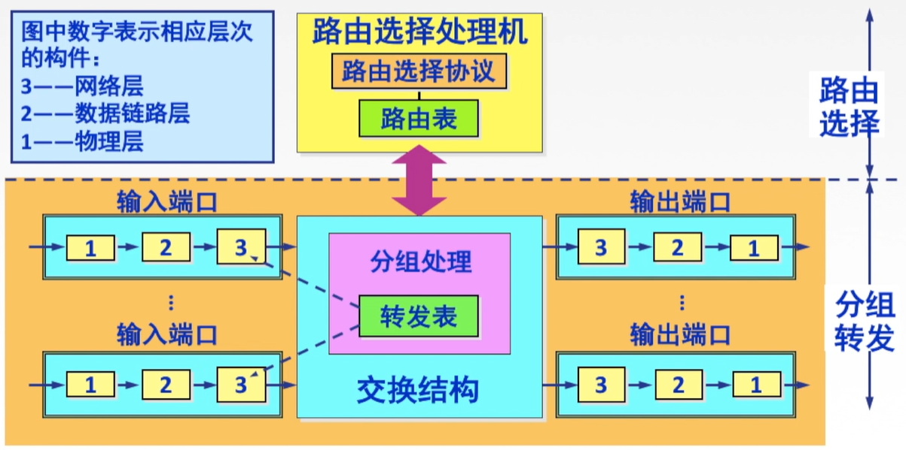

# 4.7 网络层设备

## 4.7.1 路由器的组成和功能

### 1、路由器的组成

**路由器**：路由器是一种具有多个输入端口和多个输出端口的专用计算机，其任务是<mark style="color:orange;">**转发分组**</mark>。

- **路由选择**
  - **路由选择处理机**（核心设备）
    - 根据所选定的路由选择协议<mark style="color:orange;">**构造出路由表**</mark>
    - 经常或定期地和相邻路由器交换路由信息而不断的<mark style="color:orange;">**更新和维护路由表**</mark>
  - **路由表**
- **分组转发**
  - **交换结构**（核心设备）：根据转发表对分组进行转发
    - 若收到RIP/OSPF分组等， 则把分组送往路由选择处理机
    - 若收到数据分组，则查找转发表并输出
  - **转发表**：由路由表转换得来
  - **输入端口**
  - **输出端口**

### 2、输入、输出端口对分组的处理

- **输入端口**
  - **物理层**：从线路上接收数据
  - **数据链路层**：按照协议处理数据
  - **网络层**：对收到的分组进行排序、查表和转发（<mark style="color:orange;">**产生时延**</mark>）
    - 输入端口的查表和转发功能在路由器的交换功能中是最重要的
- 输出端口
  - **网络层**：使用缓冲区存储待发送分组队列（<mark style="color:orange;">**产生时延**</mark>）
  - **数据链路层**：对数据进行封装
  - **物理层**：将数据发送到链路上



路由器中的输入或输出队列产生溢出是造成分组丢失的重要原因，即发送速度跟不上接收速度导致缓冲区被填满



## 4.7.2 三层设备的区别

- **路由器**（网络层）：可以互联两个<mark style="color:orange;">**不同网络层协议**</mark>的网段
- **网桥**（数据链路层）：可以互联两个<mark style="color:orange;">**物理层和链路层不同**</mark>的网段
- **集线器**（物理层）：**不能**互联两个物理层不同的网段

## 4.7.3 路由表与路由转发

- **路由表**
  - 路由表根据<mark style="color:purple;">**路由选择算法**</mark>得出的
  - 主要用途是路由选择
  - 总用软件来实现
- **转发表**
  - 转发表由<mark style="color:purple;">**路由表**</mark>得来
  - 可以用软件实现，也可以用特殊的硬件来实现
  - 转发表必须包含完成转发功能所必需的信息，在转发表的每一行必须包含从要到达的目的网络到输出端口和某些MAC地址信息的映射

